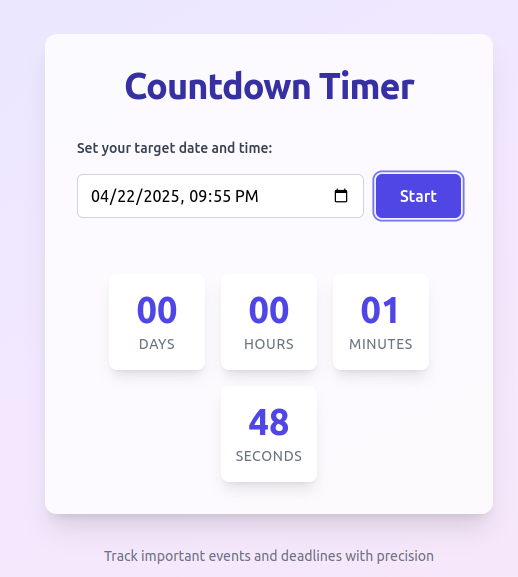

# Countdown Timer

A sleek, responsive countdown timer web application built with React and Tailwind CSS. This app allows users to set target dates and times, providing a visually appealing countdown display with days, hours, minutes, and seconds remaining.



## Features

- Set custom target dates and times
- Real-time countdown with days, hours, minutes, and seconds
- Responsive design that works on mobile and desktop
- Beautiful UI with gradient background and card-based design
- "Time's up!" notification when the countdown completes

## Technologies Used

- React.js (with Hooks)
- Tailwind CSS for styling
- Vite for fast development and building

## Installation

1. Clone the repository:
   ```
   git clone https://github.com/Samuel-Hailemariam-Seifu/countdown-timer.git
   cd countdown-timer
   ```

2. Install dependencies:
   ```
   npm install
   ```

3. Start the development server:
   ```
   npm run dev
   ```

4. Open your browser and navigate to `http://localhost:5173`

## Building for Production

To create a production build: 
npm run build


The built files will be in the `dist` directory, which you can deploy to any static hosting service.

## Usage

1. When you open the app, you'll see the countdown interface with all zeros
2. Click on the date/time input field and select your target date and time
3. Click the "Start" button to begin the countdown
4. Watch as the timer counts down to your target
5. When the time is up, you'll see a "Time's up!" message

## Customization

You can easily customize the appearance by modifying the Tailwind classes in the `App.jsx` file. The color scheme uses indigo, purple, and pink gradients by default, but you can change these to match your preferences.

## Contributing

Contributions are welcome! Please feel free to submit a Pull Request.

1. Fork the repository
2. Create your feature branch (`git checkout -b feature/amazing-feature`)
3. Commit your changes (`git commit -m 'Add some amazing feature'`)
4. Push to the branch (`git push origin feature/amazing-feature`)
5. Open a Pull Request


